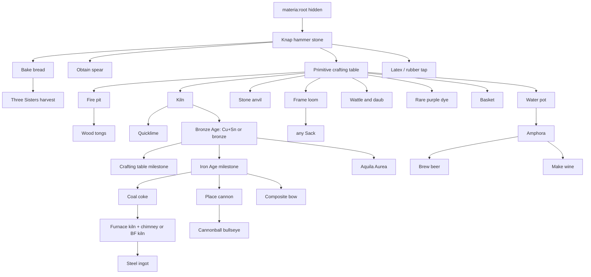

# Materia advancement plan (draft)

Working notes for a future **`materia`** advancement tab. In Minecraft these are **advancements** (the UI still says “Advancements”); each row below is one criterion plus a display **title**.

See also: [Progression (high-level guide)](mechanics/progression.md) for era ordering and gates.

---

## In-jokes the doc authors care about (players may never get it)

These are **optional flavor** for titles—fine if 0.1% of players recognize them.

### “The Secret” (hammer stone / knapping)

From the **original *Hitchhiker’s Guide to the Galaxy*** BBC radio opening: the announcer greets **“all intelligent lifeforms everywhere,”** then addresses **everyone else** with: **“…the secret is to bang the rocks together, guys!”**

So **The Secret** is the **subtle** punchline; **Bang the Rocks Together, Guys** is the same joke **on the nose** (better for players who don’t know the bit). You can also tuck the quote into the advancement **description** and keep the title short.

### “Beer Is Good” (beer)

Leaning into **Psychostick**’s **“Beer!!!”** (from *We Couldn’t Think of a Title*—hook: *Air is good / Beer is better*). If you keep **Beer Is Good** as the title, the **description** can nod to the band or the *“beer is good / and stuff”* cadence without naming it.

---

## How this could look in the advancements UI

- **One mod tab** usually has a **hidden root** (empty or trivial), then a **first visible** advancement that players discover naturally (here: first knapping / hammer stone).
- **Branches** fan out for **food**, **combat**, **building**, **metal trunk**, **textiles**, **brewing**, and **siege** so the graph is readable—long straight “era” chains work only if you occasionally hang **sibling** achievements (bread, spear, wattle) off the same parent so the tree is not a single pole.
- **Parents (`parent` in JSON)** should reflect **logical gates**, not always strict recipes: e.g. “Iron Age” should require **iron anvil** (or equivalent), not “saw bronze spear,” while “Aquila Aurea” only needs **bronze-tier gold plates** (see [recipe JSON](../shared/src/main/resources/data/materia/recipes/aquila_aurea.json)).
- **OR / optional nodes**: use a **hidden** parent or a **single** advancement with `requirements` that list **alternatives** (e.g. beer *or* wine as separate children of **amphora**).

### Suggested tree (high level)

**Fire pit** and **kiln** are **peer** unlocks after the **primitive crafting table** (not a strict A→B line): fire pit supplies recipes needed for **wood tongs**; kiln for **quicklime** and **ore heat**. **Stone anvil** only needs the PCT. **Beer** and **wine** are **siblings** under **amphora**.

**Textiles:** no **spinning wheel** advancement—frame loom is the first station in this tree (spindle → string is too small for its own advancement). **Rare dyes** parent off **PCT** only, not bronze.

---

## Advancement list

Columns: **trigger** (implementation hint) · **title** (player-facing) · **other title ideas**.

| Era / branch | Trigger (criterion hint) | Title | Other title ideas |
|--------------|-------------------------|--------|-------------------|
| Stone | Knap or obtain **hammer stone** (`materia:hammer_stone`) | **The Secret** | *Bang the Rocks Together, Guys*, *Lunchtime Doubly So* (time joke—pair with fermentation later?), *Mostly Harmless* (first tool), *First Contact* |
| Food | Bake **bread** (`minecraft:bread`) | **Next: Circuses** | *Bread and Circuses*, *The Staff of Life*, *Grain Triangle* |
| Combat | Craft any **spear** (e.g. flint tier early: `materia:flint_spear`) | **Pointed Stick** | *At Arm’s Length*, *Thrown Gauntlet*, *Line Infantry* (if any spear) |
| Exploration | Obtain **latex** (`materia:latex`) and/or interact with **tapped rubber** ([Rubber tree](content/blocks/rubber-tree.md), [tapped log](content/blocks/tapped-rubber-tree-log.md)) | **Sticky Business** | *Latex Bloom*, *Treeblood*, *Elastic Ethics* |
| Neolithic | Craft **primitive crafting table** (`materia:primitive_crafting_table`) | **The Neolithic Age** | *A Fixed Address*, *The Rough Workshop*, *Second-Rate Grid* |
| Neolithic | Craft / place **stone anvil** (`materia:stone_anvil`) — **only requires PCT** in Materia, not a kiln | **Ring of Truth** | *Strike While It’s Hot*, *First Anvil*, *Nugget Justice* |
| Neolithic | Craft / place **fire pit** (`materia:fire_pit`) — **peer** with kiln: needed for **wood tongs** chain | **Controlled Burn** | *Hearth and Ash*, *Not Just a Campfire*, *Trial by Smoke* |
| Neolithic | Craft / place **kiln** (`materia:kiln`) — **peer** with fire pit: **quicklime** + ore heating | **Trial by Fire** | *Hot Enough Already*, *Ring Kiln*, *Heart of the Stack* |
| Building / lime | Obtain **quicklime** (`materia:quicklime`) — kiln route | **Speedy Citrus** | *Quick to Judge*, *Calcined Ambition*, *Not That Kind of Lime* |
| Neolithic | Obtain **wood tongs** (`materia:wood_tongs`) — fire-pit-related chain | **Handle With Care** | *Finger Insurance*, *Don’t Panic* (towel-adjacent), *Gripping Reality* |
| Neolithic / Bronze | **Bronze milestone** (single advancement): obtain **`materia:bronze_ingot`** **or** (reasonable OR) both **`minecraft:copper_ingot`** and **`materia:tin_ingot`**—treat alloying as part of the same beat | **The Bronze Age** | *Stream Bed Fortune*, *Tempered Copper*, *Bell Metal*, *Forgotten Tin Road* |
| Neolithic | Craft / place **water pot** (`materia:water_pot`) | **Depth of Boiling** | *Kitchen Cauldron*, *Rolling Boil*, *Pot Commitment* |
| Neolithic | Craft / place **amphora** (`materia:amphora`) | **Jar Theology** | *Bulk Spirit*, *Fermentation Vessel*, *Amphora Borealis* |
| Building | Craft / place **wattle and daub** (`materia:wattle_and_daub`) | **Between the Laths** | *Mud and Wattle*, *Clay Between the Sticks*, *Hardened Hovel* |
| Farming | Fully harvest **Three Sisters** crop (`materia:three_sisters_crop` — mature break or pick) | **Sister Act** | *Mound Economics*, *Three for One*, *Guild of the Corn* |
| Neolithic / Bronze | Craft **vanilla crafting table** (Materia milestone recipe) | **CB** | *Communal Blueprints*, *Four-by-Four*, *Measured Cuts* |
| Chemistry | Craft **magenta**, **Tyrian purple**, or **purple** dye (see [Dyes](chemistry/dyes.md)) — **only PCT** (and recipe inputs); **not** gated on bronze | **Now You Know Why It Was So Expensive** | *Tyrian Tribute*, *Mollusk Economy*, *Royal Ledger* |
| Textiles | Craft **frame loom** or weave **one carpet** on it (no separate **spinning wheel** achievement) | **Under the Warp** | *Weft Capital*, *Frame Contract*, *Eight-String Theory* |
| Textiles / storage | Craft **`materia:sack`** or any dyed sack item (`materia:*_sack`)—encode exact list in advancement JSON | **Pack Rat Royalty** | *Stitched Inventory*, *Portable Pantry*, *Needle and Mundanity* |
| Textiles / storage | Craft / place **basket** (`materia:basket`) | **Lattice Logistics** | *Woven Burden*, *Wicker Basket Case*, *Grid Inventory* |
| Iron | First **wrought iron ingot** or place **iron anvil**—pick what matches your pack better | **The Iron Age** | *Bloom and Bust*, *Heavier Than Bronze*, *The Anvil Upgrade* |
| Steel / fuel | Obtain **coal coke** (`materia:coal_coke`) or place **coke oven** (`materia:coke_oven`) | **Cooked Carbon** | *The Coking Shift*, *Share and Enjoy*, *Industrial Char* |
| Steel / heat | Place **furnace chimney** atop **furnace kiln** (`materia:furnace_chimney` / `materia:furnace_kiln`) **or** place **blast furnace kiln** (see [Progression](mechanics/progression.md) steel walkthrough) | **Stacked Heat** | *Chimney Sweep’s Revenge*, *Blast Resort*, *Second Stack’s the Charm* |
| Steel | Obtain **steel ingot** (vanilla `iron_ingot` displayed as steel—see [Steel ingot](content/items/steel-ingot.md)) | **Carbon Temper** | *The Steel Age*, *Coke and Conviction*, *Harder Stock* |
| Display / gold | Craft **Aquila Aurea** (needs **gold plates**—[recipe](../shared/src/main/resources/data/materia/recipes/aquila_aurea.json)) | **Wings of Empire** | *Aquila Aurea*, *Gilded Standard*, *Eagle Ascending* |
| Brewing | Finish **beer** (amphora / bottled output—[Hops and beer](mechanics/hops-and-beer.md)); **parent: amphora** (sibling of wine) | **Beer Is Good** (likely final; Psychostick “Beer!!!” energy) | *Air Is Good; Beer Is Better* (same song, wordier), *Liquid Bread*, *Barley Legal* |
| Brewing | Obtain **wine** (sealed amphora route); **parent: amphora** (sibling of beer) | **In Vino Veritas** | *Terroir*, *Vintage Lock*, *Purple Stain* |
| Siege | Place or craft **cannon** (`materia:cannon`—criteria TBD) | **Breach Loader** | *Loose Lips Sink Ships*, *This Is My Boomstick*, *Gun-Carriage Culture* |
| Siege | Deal killing blow **or** heavy hit with **cannonball** to mob (criteria TBD) | **Roundshot Ringer** | *Direct Fire*, *Gunner’s Mark*, *Million-to-One Chance* |
| Combat | Craft **composite bow** (`materia:composite_bow`) | **Stored Energy** | *Cantilever Violence*, *Layered Tension*, *Sprung Faith* |

Prefer one **`item` tag** for “any sack” in datapack if you add it; otherwise list sack item IDs in the advancement.

---

## Notes on ordering vs. your original scratch list

- **Fire pit** and **kiln** are **same-tier** after **PCT**; do not imply a forced order. **Tongs** hang off **fire pit**; **quicklime** (and the metal-heating role of the kiln) off **kiln**.
- **Stone anvil** unlocks from **primitive crafting table only**—no kiln prerequisite for the advancement story.
- **Copper + tin + bronze** are **one advancement** (`The Bronze Age`): separate “starter metal” vs “alloy” steps are too granular for the UI; use an **OR** of bronze ingot vs “has both base ingots” if you want early credit.
- **Rare dyes** parent off **PCT**—not bronze—in your intent; keep **Aquila** / **iron** separate where the recipes actually demand metal.
- **Spear** and **bread** stay **early siblings** off knapping / stone tools.
- **Crafting table (“CB”)** stays **after bronze**; **water pot** is in that recipe—parent **CB** after **water pot** + **bronze** as needed.
- **Spindle** → string: **no** dedicated advancement (too trivial). **Frame loom** leads **sack**; **spinning wheel** is out of this list.
- **Beer** and **wine** are **both** children of **amphora** (siblings); no separate “drunk” advancement.
- **Aquila Aurea** remains a **display / gold** branch from **bronze-age** capability, not “steel wins.”
- **Steel** substeps (**coke** → **high-heat** → **ingot**) stay for clarity; unrelated to brewing.
- **Siege**: **Breach Loader** before **Roundshot Ringer**.
- **Exploration / farming**: **Sticky Business** and **Sister Act** optional off **stone** / **bread** (diagram suggestive only).

---

## Deep-cut title bank (pair with milestones you add later)

Use as **titles** or **descriptions**. Spoilers for *Hitchhiker’s*, Python, *Discworld*, etc.

### *Hitchhiker’s Guide* (radio + novels)

| If this is the trigger… | Title ideas | Notes |
|---------------------------|-------------|--------|
| First login / world join (hidden or joke) | **Intelligent Lifeforms Everywhere** | Straight from the same opening; may read weird as a “real” advancement. |
| Wrong or “almost” brew | **Almost, But Not Quite, Entirely Unlike Tea** | Canonical Nutri-Matic punchline; best if you ever have a joke failure output. |
| Food / silly sustenance | **A Nice Cup of Tea** | Deep lore; only lands if the item fits. |
| Fermentation / long timers | **Time Is an Illusion** | Lunchtime doubly so—fits **amphora** wine clock. |
| Hot metals / tongs / not burning yourself | **Don’t Panic** | Obvious but evergreen; towel optional. |
| Coke oven / absurd industrial chain | **Share and Enjoy** | Sirius Cybernetics / meaningless slogans for depressing processes. |
| Logic/computer/automation (if you gate it) | **It’ll Have to Go** | **GPP**-adjacent fatalism. |
| Cannon (build or fire) | **Point of View Gun** | Alternate title if you want H2G2 over **Breach Loader** / **Boomstick** vibes. |
| Mining deep / boring through stone | **Semantic and Philosophic** | The ship that stayed **put**—**rock** still won. Fits **tunnel / strip** humor. |
| Something fails but outputs anyway | **Almost No Improbability** | Forgiving recipe joke. |

### Monty Python & co.

| Trigger… | Title ideas |
|----------|-------------|
| Bread (you already use circuses) | **What Have the Bread Ever Done for Us?** (mouthful), **Now for Something Completely Different** (first station swap) |
| Run away from combat | **Brave Sir Ran Away** |
| Low health, survive | **Not Dead Yet** (also *Holy Grail*) |
| Fish / river loot joke | **How Not to Be Seen** (stretch) |

### *Discworld* (Pratchett)

| Trigger… | Title ideas |
|----------|-------------|
| Octarine / rare dye / “impossible” color | **Octarine Tint** (if you ever name a dye that way) |
| Guild / economic grind | **Ankh-Morpork Civic Pride** |
| Million-to-one cannon shot | **Million-to-One Chance** (quoted in several books) |
| Sobriety joke (only if you add an effect later) | **Knurd** (*Discworld* / *Discworld II*—“opposite of drunk”) |

### Ash / boomstick energy (*Army of Darkness*—you already have **Pointed Stick**)

| Trigger… | Title ideas |
|----------|-------------|
| First gunpowder or cannon | **This Is My Boomstick**, **Good, Bad, I’m the Guy With the Gun** |

### Misc nerdy

| Trigger… | Title ideas |
|----------|-------------|
| Redundant spare tool | **Spare Brain** (H2G2 mice—not cruel, just “extra part”) |
| Co-op / server in-joke | **Belgium** (radio-clean insult in *Hitchhiker’s*—know your audience) |

---

## Implementation reminders (later)

- Prefer **`inventory_changed`** / **`recipe_crafted`** / **`placed_block`** over vague triggers.
- For **stacked heat**, you may need a **location-based** check (chimney directly above furnace kiln) or a **distinct “formed multiblock”** state if the mod exposes one—otherwise “obtain both blocks + place” is a weaker stand-in.
- **Three Sisters**: fire on **mature** crop break/harvest only (match blockstate or age property from `three_sisters_crop`).
- **Sacks**: an `inventory_changed` criterion with a **tag** covering all `*_sack` items keeps maintenance sane.
- Cannon criteria may need **placement**, **projectile hit**, or kill attribution hooks depending on how cannon damage is tagged.
