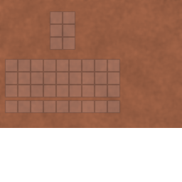

## Amphora

An amphora is a container block used for storing either **solids** or **liquids**.

## GUI (solid storage)

Slot layout (solid mode):

- **6 slots** (3 rows × 2 columns)

Rules:

- You can’t put an amphora inside another amphora.
- While fermenting, the amphora is locked (no GUI / no interactions).

## Obtaining

- **Crafting**: see [Amphora recipe JSON](../../../shared/src/main/resources/data/materia/recipes/amphora.json)
- **Unfired variant**: [Unfired amphora recipe JSON](../../../shared/src/main/resources/data/materia/recipes/unfired_amphora.json)

## Usage

- **Solid storage**: 6-slot container
- **Liquid storage**: holds up to 9 units (9 bottles = 3 buckets)
- **Lids**:
  - lid / sealed lid close the amphora
  - grape juice can ferment into vinegar/wine depending on lid type (see below)
- **Liquid transfer**: supports bottles/cups (1 unit) and pots/buckets (3 units)

See: [Liquids and containers (reference)](../../reference/tags/liquids-and-containers.md)

Common containers:

- **Cups/crucibles (1 unit)**:
  - [Crucible](../items/crucible.md)
  - [Water cup](../items/water-cup.md)
  - [Milk cup](../items/milk-cup.md)
- **Pots/buckets (3 units)**:
  - [Water pot](water-pot.md)
  - [Milk pot](milk-pot.md)

Liquid item pages:

- [Grape juice](../items/grape-juice.md)
- [Vinegar](../items/vinegar.md)
- [Wine cup](../items/wine-cup.md)
- [Olive oil](../items/olive-oil.md)

## Fermentation (grape juice)

If an amphora contains **grape juice**, adding a lid will start fermentation:

- **Lid** → grape juice becomes **vinegar** (about 20 minutes)
- **Sealed lid** → grape juice becomes **wine** (about 60 minutes)

Notes:

- While fermenting, the amphora is **locked** (no interactions until it finishes).
- Fermentation changes the **liquid type**, not the amount.

## Visuals

Add screenshots here when it helps:

- `documentation/assets/screenshots/amphora/`

## Related

- [Amphora and liquids](../../mechanics/amphora-and-liquids.md)
