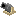

## Cannon

The cannon is an artillery block you can load with **powder** and **ammo**, then enter an aim mode (“cannon’s eye view”) to fire.

## Crafting

- [Recipe JSON](../../../shared/src/main/resources/data/materia/recipes/cannon.json)

Key ingredients in the recipe:

- `materia:cannon_barrel` (component)
- `materia:iron_rivets`
- `materia:rope`
- [`#materia:posts`](../../reference/tags/early-crafting-and-woodworking.md#materiaposts)
- [`#materia:smooth_planks`](../../reference/tags/early-crafting-and-woodworking.md#materiasmooth_planks)

## Using the cannon (quick guide)

- **Right-click with gunpowder** (or a gunpowder trail item) to add **powder** (up to 4)
- **Right-click with ammo** to load it (ammo requires powder)
- **Right-click with empty hand** to enter aim mode
- **Left-click** to fire

For full details and controls:

- [Cannons (mechanics)](../../mechanics/cannons.md)

## Ammo

Valid ammo is defined by [`#materia:cannon_ammo`](../../reference/tags/combat-and-explosives.md#materiacannon_ammo):

- Tag JSON: `shared/src/main/resources/data/materia/tags/items/cannon_ammo.json`

It includes:

- `materia:stone_cannonball`
- `materia:iron_cannonball`
- `materia:canister_shot`
- `minecraft:tnt`

Ammo pages:

- [Stone cannonball](../items/stone-cannonball.md)
- [Iron cannonball](../items/iron-cannonball.md)
- [Canister shot](../items/canister-shot.md)

## Related

- [Cannon barrel](../items/cannon-barrel.md)
