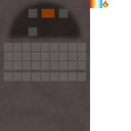

## Coke oven

The coke oven converts **coal** into **coal coke** using fuel.

## GUI

Slot layout:

- **Input**: coal
- **Fuel**: coal (the coke oven only accepts coal)
- **Output**: coal coke

## How it works

- **Input**: coal
- **Fuel**: coal (the coke oven only accepts coal)
- **Output**: coal coke

## Notes

Coal coke burns longer than coal/charcoal and is required for some high-heat kiln recipes.

See also:

- [Heat and fuel overview](../../mechanics/heat.md)
- [Kilns](../../mechanics/kilns.md)
