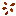

## Crops (blocks)

Materia adds multiple new crops and several wild “starter plants”.

Mechanics overview:

- [Crops and farming (mechanics)](../../mechanics/crops.md)

## Farm crops (farmland crops)

### Corn

- **Crop block**: `materia:corn_crop`
- **Seed item**: `materia:corn`
- **Tall crop**: becomes a 2-block-tall plant at age 4+ (upper block is part of the crop)

Drops are defined by:

- `shared/src/main/resources/data/materia/loot_tables/blocks/corn_crop.json`

### Beans

- **Crop block**: `materia:beans_crop`
- **Seed item**: `materia:beans`

Drops:

- `shared/src/main/resources/data/materia/loot_tables/blocks/beans_crop.json`

### Squash

- **Crop block**: `materia:squash_crop`
- **Seed item**: `materia:squash_seeds`

Drops:

- `shared/src/main/resources/data/materia/loot_tables/blocks/squash_crop.json`

### Peppers

- **Crop block**: `materia:peppers_crop`
- **Seed item**: `materia:pepper_seeds`

Drops:

- `shared/src/main/resources/data/materia/loot_tables/blocks/peppers_crop.json`

### Flax

- **Crop block**: `materia:flax_crop`
- **Seed item**: `materia:flax_seeds`

Flax is the crop that explicitly feeds your early textiles:

- mature flax yields **plant fiber** (and seeds)

Drops:

- `shared/src/main/resources/data/materia/loot_tables/blocks/flax_crop.json`

## Three Sisters (polyculture)

The Three Sisters crop is a special farmland crop block that can hold up to 3 crops at once.

See:

- [Three Sisters crop](three-sisters-crop.md)

## Wild plants (worldgen starters)

These generate in the world so you can get seeds without already having a farm.

Wild crop placements (biome modifier):

- `shared/src/main/resources/data/materia/forge/biome_modifier/materia_wild_crops.json`

### Wild flax

- **Block**: `materia:wild_flax`
- **Drops**: always flax seeds, plus a chance at plant fiber
  - `shared/src/main/resources/data/materia/loot_tables/blocks/wild_flax.json`

### Wild corn

- **Block**: `materia:wild_corn`
- **Drops**: corn seeds, with a chance for extra
  - `shared/src/main/resources/data/materia/loot_tables/blocks/wild_corn.json`

### Wild beans / squash / peppers

- `materia:wild_beans` → `shared/src/main/resources/data/materia/loot_tables/blocks/wild_beans.json`
- `materia:wild_squash` → `shared/src/main/resources/data/materia/loot_tables/blocks/wild_squash.json`
- `materia:wild_peppers` → `shared/src/main/resources/data/materia/loot_tables/blocks/wild_peppers.json`

## Indigo (wild dye plant)

Indigo is a wild plant (not a farmland crop) that feeds dye/textiles.

- **Block**: `materia:indigo`
- **Drops**: `materia:indigo`
  - `shared/src/main/resources/data/materia/loot_tables/blocks/indigo.json`

Worldgen placement:

- `shared/src/main/resources/data/materia/forge/biome_modifier/materia_indigo.json`

