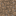

## Earth

Earth is a dirt-like natural block used throughout Materia as a basic building and processing material.

In newer Minecraft versions, Earth is intended to be interchangeable with vanilla **packed mud** in many recipes and mechanics.

## Block ID

- `materia:earth`

## Drops

- Loot table: `shared/src/main/resources/data/materia/loot_tables/blocks/earth.json`

## Interchangeability (packed mud)

When you see `#materia:earth_blocks` in recipes, it means:

- `materia:earth`
- `minecraft:packed_mud` (optional, only exists in newer vanilla versions)

Tag JSON:

- `shared/src/main/resources/data/materia/tags/items/earth_blocks.json`

## Used by recipes (examples)

Some recipes accept “Earth-like blocks” via `#materia:earth_blocks`, for example:

- Fire pit: `shared/src/main/resources/data/materia/recipes/fire_pit.json`
- Kiln: `shared/src/main/resources/data/materia/recipes/kiln.json`
- Wattle and daub: `shared/src/main/resources/data/materia/recipes/wattle_and_daub.json`

## Processing: clay + dirt separation (water pot)

See: [Earth (and packed mud)](../../mechanics/earth-and-packed-mud.md)

