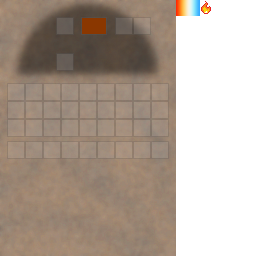

## Fire pit

The fire pit is an early cooking/processing station with its own GUI.

## Getting one

- [Recipe JSON](../../../shared/src/main/resources/data/materia/recipes/fire_pit.json)

## How it works

- Put an item in the input slot
- Add fuel
- Results appear in the output slots

## GUI

Slot layout:

- **Input**: the item being processed
- **Fuel**: burns fuel items
- **Outputs**: fire pit recipes can produce **up to 5 outputs**; they appear in the output row(s)

Related:

- [Fire pit (mechanic)](../../mechanics/fire-pit.md)
