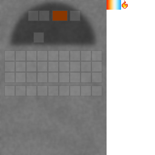

## Forge

The forge is Materia's high-heat smelting block with its own GUI. It replaces the old furnace-kiln lookalike with a distinct block and textures.

Vanilla `minecraft:furnace` remains a normal craftable block (cobblestone recipe) for mod compatibility.

## GUI

## Crafting

Crafted from Materia components:

- `shared/src/main/resources/data/materia/recipes/forge.json`

Key ingredients:

- `materia:fire_brick_block`
- `materia:bellows`
- `materia:mortar`

## Furnace chimney (required for some recipes)

Some high-heat recipes (notably iron smelting) require a **furnace chimney** block placed above the forge.

See:

- [Furnace chimney](furnace-chimney.md)
- [Iron ingot](../items/iron-ingot.md)

## Related

- [Kilns (mechanic)](../../mechanics/kilns.md)
- [Heat and fuel overview](../../mechanics/heat.md)
