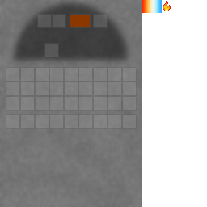

## Furnace kiln

The furnace kiln is a high-heat kiln variant (a “modded furnace”) with its own GUI.

## GUI

## Crafting

The vanilla `minecraft:furnace` recipe is overridden to craft a furnace kiln:

- `shared/src/main/resources/data/minecraft/recipes/furnace.json`

Key ingredients:

- `materia:fire_brick_block`
- `materia:bellows`
- `materia:mortar`

## Furnace chimney (required for some recipes)

Some high-heat recipes (notably steelmaking) require a **furnace chimney** block placed above the furnace kiln.

See:

- [Furnace chimney](furnace-chimney.md)
- [Steel ingot](../items/steel-ingot.md)

## Related

- [Kilns (mechanic)](../../mechanics/kilns.md)
- [Heat and fuel overview](../../mechanics/heat.md)

