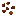

## Grape vine

The grape vine system has three main blocks:

- planted crop: `materia:grape_vine`
- hanging crop: `materia:grapes_hanging`
- wild vine: `materia:wild_grape_vine`

For the big-picture system: [Vines (wisteria + grapes)](../../mechanics/vines.md)

## Planted grape vines (`materia:grape_vine`)

Planted using:

Notes:

- Grapes are grown by planting seeds on farmland, then letting the mature vine attach to supports.
- Supports are defined by `#materia:grape_vine_supports`:
  - Tag JSON: `shared/src/main/resources/data/materia/tags/blocks/grape_vine_supports.json`

## Harvesting

There are two main harvest paths:

- **Support blocks** (posts/trellises/joists) when they have grapes: right-click to harvest grapes and seeds.
- **Hanging grapes** (`materia:grapes_hanging`) when mature: right-click to harvest grapes (and sometimes seeds).

## Wild grape vines (`materia:wild_grape_vine`)

Wild vines grow on trees in worldgen. Right-clicking can drop:

- grape seeds
- plant fiber

## Related

- [Wisteria vine](wisteria-vine.md)
- [Trellises (wood variants)](wood-trellises.md)
- [Grape juice](../items/grape-juice.md) (made from grapes; used for fermentation chains)
