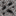

## Tin gravel

Tin gravel is a natural “alluvial” ore deposit. It’s one of the main early sources of **tin**.

## Block ID

- `materia:gravel_tin`

## Where it generates

In 1.18.2, tin gravel is added as worldgen “veins per chunk”, with extra frequency in rivers and beaches:

- `1.18.2/src/main/java/com/torr/materia/world/ModWorldEvents.java`
- `1.18.2/src/main/java/com/torr/materia/world/feature/ModPlacedFeatures.java`

Practical tip:

- Look in **riverbeds, beaches, and shallow water** areas first.

## Drops

Tin gravel drops:

- `materia:raw_tin`
- `materia:pebble` (extra drops)

Loot table:

- `shared/src/main/resources/data/materia/loot_tables/blocks/gravel_tin.json`

## Related

- Item: [Raw tin](../items/raw-tin.md)
- Mechanics: [Kilns](../../mechanics/kilns.md) (processing)
- Progression: [Progression](../../mechanics/progression.md)

