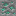

## Malachite

Malachite is Materia’s surface-exposed copper ore replacement. Breaking it drops **raw copper**.

## Block ID

- `materia:malachite`

## Where it generates

In 1.18.2, malachite is placed as an “air-exposed” surface ore feature (it targets exposed copper ore positions):

- `1.18.2/src/main/java/com/torr/materia/world/ModWorldEvents.java`
- `1.18.2/src/main/java/com/torr/materia/world/feature/ModPlacedFeatures.java` (`MALACHITE_ORE_PLACED`)

Practical tip:

- Look in **hills/mountains and other exposed stone** areas where ores are visible.

## Drops

- Drops `minecraft:raw_copper`

Loot table:

- `shared/src/main/resources/data/materia/loot_tables/blocks/malachite.json`

## Related

- Item: [Copper nugget](../items/copper-nugget.md)
- Mechanics: [Kilns](../../mechanics/kilns.md)
- Progression: [Progression](../../mechanics/progression.md)

