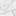

## Marble

Marble is a decorative stone material that generates in the world and can be processed into carved/column/statue variants.

## Where it generates

Marble generates in the overworld as large “veins” (ore-feature style replacement of stone/deepslate).

If you want the exact generator knobs for 1.21.1, see:

- `1.21.1/src/generated/resources/data/materia/worldgen/configured_feature/marble_vein.json`
- `1.21.1/src/generated/resources/data/materia/worldgen/placed_feature/marble_vein_surface_placed.json`
- `shared/src/main/resources/data/materia/forge/biome_modifier/materia_overworld_underground_ores_common.json`

## Processing (stonecutting)

Marble has several stonecutter outputs:

- carved marble: `materia:marble_carved`
  - [Stonecutting recipe JSON](../../../shared/src/main/resources/data/materia/recipes/marble_carved_from_marble_stonecutting.json)
- marble column: `materia:marble_column`
  - [Stonecutting recipe JSON](../../../shared/src/main/resources/data/materia/recipes/marble_column_from_marble_stonecutting.json)
- marble bust: `materia:marble_bust`
  - [Stonecutting recipe JSON](../../../shared/src/main/resources/data/materia/recipes/marble_bust_from_marble_stonecutting.json)
- marble body: `materia:marble_body`
  - [Stonecutting recipe JSON](../../../shared/src/main/resources/data/materia/recipes/marble_body_from_marble_stonecutting.json)

## Statues

Marble statues are made from the **body + bust** blocks.

See:

- [Statues](statues.md)

