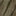
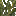
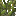
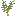

## Olive tree

Olive trees are a worldgen tree that provides:

- **Olives** (food ingredient)
- **Olive oil** (crafted from olives; used as a lipid and as lamp oil)

## Where it generates

Olive trees are added to temperate biomes via a biome modifier:

- `shared/src/main/resources/data/materia/forge/biome_modifier/materia_olive_trees.json`

## Blocks

- Log: `materia:olive_tree_log`
  - Loot table: `shared/src/main/resources/data/materia/loot_tables/blocks/olive_tree_log.json`
- Leaves: `materia:olive_tree_leaves`
  - Loot table: `shared/src/main/resources/data/materia/loot_tables/blocks/olive_tree_leaves.json`
- Sapling: `materia:olive_sapling`

## Harvesting olives (from leaves)

In 1.18.2, olive leaves have a built-in “fruiting” state:

- `HAS_OLIVES` is a blockstate property on `OliveTreeLeavesBlock`
- When `HAS_OLIVES=true`, right-clicking the leaves drops **1–3 olives** and clears the flag.
- While `HAS_OLIVES=false`, olives regrow via random ticks (20% chance per random tick).

Source of truth:

- `1.18.2/src/main/java/com/torr/materia/block/OliveTreeLeavesBlock.java`

Also note (breaking leaves):

- The olive leaves loot table can drop olives when broken (and saplings at a low chance), similar to vanilla leaves behavior.

## Fire pit: log to charcoal

Olive logs can be processed in a fire pit:

- `shared/src/main/resources/data/materia/recipes/olive_log_to_charcoal.json`

This yields:

- `minecraft:charcoal`
- `materia:ash`

## Related

- Item: [Olives](../items/olives.md)
- Item: [Olive oil](../items/olive-oil.md)
- Mechanics: [Tapping](../../mechanics/tapping.md) (rubber trees and sap trees)

