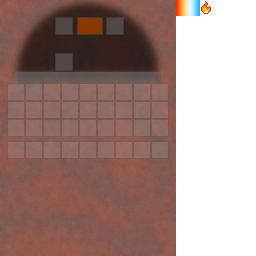

## Oven

The oven is a cooking station with a custom GUI. It primarily runs **oven recipes** (baking/cooking), and can fall back to vanilla smelting *only* when the result is edible.

## Obtaining

- [Oven recipe JSON](../../../shared/src/main/resources/data/materia/recipes/oven.json)

## GUI

Slot layout:

- **Input**
- **Fuel**
- **Output**

## What it cooks

The oven uses:

- recipe type: `materia:oven`
- example recipe JSON: `shared/src/main/resources/data/materia/recipes/oven_*.json`

If no oven recipe matches, it may fall back to vanilla **smelting** recipes, but only if the smelting result is edible.

## Related

- [Heat and fuel overview](../../mechanics/heat.md)
