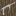

## Rubber tree

Rubber trees are a worldgen tree that provides **latex** via the tapping system.

## Where it generates

Rubber trees are added to tropical biomes via a biome modifier:

- `shared/src/main/resources/data/materia/forge/biome_modifier/materia_rubber_trees.json`

## Blocks

- Log: `materia:rubber_tree_log`
  - Loot table: `shared/src/main/resources/data/materia/loot_tables/blocks/rubber_tree_log.json`
- Leaves: `materia:rubber_tree_leaves`
  - Loot table: `shared/src/main/resources/data/materia/loot_tables/blocks/rubber_tree_leaves.json`
- Sapling: `materia:rubber_tree_sapling`
  - Loot table: `shared/src/main/resources/data/materia/loot_tables/blocks/rubber_tree_sapling.json`
- Tapped log: `materia:tapped_rubber_tree_log`
  - Loot table: `shared/src/main/resources/data/materia/loot_tables/blocks/tapped_rubber_tree_log.json`

## Getting latex (tapping)

Latex is gathered by right-clicking rubber logs with certain early cutting tools.

In 1.18.2, the “tapping” action is implemented directly in the tool items:

- Right-click `materia:rubber_tree_log` with:
  - `materia:knapped_flint`
  - `materia:flint_knife`
  - `materia:iron_knife`
  - `materia:steel_knife`

Result:

- The log becomes `materia:tapped_rubber_tree_log` (axis preserved).
- It drops **1–2** `materia:latex`.
- The tool takes **1 durability** damage and plays a “flint craft” sound.

Source of truth:

- `1.18.2/src/main/java/com/torr/materia/item/KnappedFlintItem.java`
- `1.18.2/src/main/java/com/torr/materia/item/FlintKnifeItem.java`
- `1.18.2/src/main/java/com/torr/materia/item/IronKnifeItem.java`
- `1.18.2/src/main/java/com/torr/materia/item/SteelKnifeItem.java`

Full mechanics page:

- [Tapping (sap and latex)](../../mechanics/tapping.md)

## Fire pit: log to charcoal (and byproducts)

Rubber logs can be processed in a fire pit:

- Rubber log: `shared/src/main/resources/data/materia/recipes/rubber_tree_log_to_charcoal.json`
  - yields `minecraft:charcoal` + `materia:latex`
- Tapped rubber log: `shared/src/main/resources/data/materia/recipes/tapped_rubber_tree_log_to_charcoal.json`
  - yields `minecraft:charcoal` + `materia:ash`

## Related

- Item: [Latex](../items/latex.md)
- Mechanics: [Tapping](../../mechanics/tapping.md)

