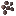

## Wisteria vine

The wisteria vine system has three main blocks:

- planted crop: `materia:wisteria_vine`
- hanging block: `materia:wisteria_hanging`
- wild vine: `materia:wild_wisteria_vine`

For the big-picture system: [Vines (wisteria + grapes)](../../mechanics/vines.md)

## Planted wisteria vines (`materia:wisteria_vine`)

Planted using:

Notes:

- Wisteria is grown by planting seeds on farmland, then letting the mature vine attach to supports.
- Supports are defined by `#materia:wisteria_vine_supports`:
  - Tag JSON: `shared/src/main/resources/data/materia/tags/blocks/wisteria_vine_supports.json`

## Harvesting

There are two main harvest paths:

- **Support blocks** (posts/trellises/joists) when they have wisteria flowers: right-click to harvest seeds (and sometimes plant fiber).
- **Hanging wisteria** (`materia:wisteria_hanging`): right-click for a chance at seeds and plant fiber.

## Wild wisteria vines (`materia:wild_wisteria_vine`)

Wild vines grow on trees in worldgen. Right-clicking can drop:

- wisteria seeds
- plant fiber

## Known issue

- Wisteria and grape vines can currently overlap (missing visuals for the “both vines” state). Intended behavior later is to prevent them from growing together.

## Related

- [Grape vine](grape-vine.md)
- [Trellises (wood variants)](wood-trellises.md)
