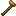

## Bronze hammer

The bronze hammer is one of the first “real” metal hammers. It’s used both as a tool and as a required ingredient in some progression recipes.

## Crafting

Assembled as an item recipe:

- `shared/src/main/resources/data/materia/recipes/bronze_hammer.json`

Ingredients:

- `materia:bronze_hammer_head`
- `materia:handle`
- 2× `materia:lashing`

## Getting a bronze hammer head

You can make the head on an anvil from a bronze ingot:

- Stone anvil:
  - `shared/src/main/resources/data/materia/recipes/stone_anvil/bronze_hammer_head_from_ingot.json`
- Bronze anvil (also works):
  - `shared/src/main/resources/data/materia/recipes/bronze_anvil/bronze_hammer_head_from_ingot.json`

## Related

- [Bronze ingot](bronze-ingot.md)
- [Anvils](../../mechanics/anvils.md)

