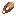

## Bronze shears

Bronze shears are a metalworking-era tool. They’re also part of the “unlock vanilla crafting table” milestone recipe in `shared/`.

## Crafting

- `shared/src/main/resources/data/materia/recipes/bronze_shears.json`

Key ingredients:

- `materia:bronze_blade`
- `materia:bronze_wire`
- `#materia:advanced_bindings`

Tag reference:

- `#materia:advanced_bindings`: [Bindings and adhesives](../../reference/tags/bindings-and-adhesives.md#materiaadvanced_bindings)

## Making the blade and wire

These are generally made through the anvil chain:

- Blade from rod:
  - `shared/src/main/resources/data/materia/recipes/bronze_anvil/bronze_blade_from_rod.json`
- Wire from rod:
  - `shared/src/main/resources/data/materia/recipes/bronze_anvil/bronze_wire_from_rod.json`
  - Requires `bronze_tongs` and a `bronze_drawplate`

Related:

- [Tongs](tongs.md)
- [Anvils](../../mechanics/anvils.md)
- [Progression](../../mechanics/progression.md)

