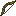

## Composite bow

The composite bow is a stronger upgrade to the vanilla bow.

Its mechanics are “still bow mechanics” (draw → fire an arrow), but it’s tuned to feel faster and hit harder.

## Crafting

- [Recipe JSON](../../../shared/src/main/resources/data/materia/recipes/composite_bow.json)

Ingredient notes:

- **Bow limbs**: `materia:bow_limb` ([Recipe JSON](../../../shared/src/main/resources/data/materia/recipes/bow_limb.json))
- **Bowstrings**: `#materia:strong_bowstrings` (see [tag reference](../../reference/tags/textiles-and-storage.md#materiastrong_bowstrings))
- **Adhesives**: `#materia:strong_adhesives` (see [tag reference](../../reference/tags/bindings-and-adhesives.md#materiastrong_adhesives))
- **Handle**: `materia:handle` ([Handle](handle.md))

## Stats / behavior (from code)

Current behavior is implemented in `1.21.1` as `CompositeBowItem`:

- **Faster draw**: reaches full power faster than a vanilla bow
- **Higher projectile speed**: arrows are launched faster
- **Higher base damage**: adds a flat bonus damage on top of the arrow projectile’s base damage

## Modded arrows

Materia adds craftable “metal arrows” that behave like arrows but with higher base damage.

Icons:

Recipe JSONs:

- [Bronze arrow](../../../shared/src/main/resources/data/materia/recipes/bronze_arrow.json)
- [Iron arrow](../../../shared/src/main/resources/data/materia/recipes/iron_arrow.json)
- [Steel arrow](../../../shared/src/main/resources/data/materia/recipes/steel_arrow.json)

Arrow-head crafting notes:

- Flint arrow heads: [Recipe JSON](../../../shared/src/main/resources/data/materia/recipes/flint_arrow_head.json)
- Metal arrow heads are also craftable via anvil recipes (see `shared/src/main/resources/data/materia/recipes/*_anvil/*arrow_head*.json`)

Binding requirement used by arrow recipes:

- `#materia:basic_bindings` (see [tag reference](../../reference/tags/bindings-and-adhesives.md#materiabasic_bindings))

## Related

- [Bow (recipe override)](bow.md)
- [Arrows (flint + metal)](metal-arrows.md)
- [Crossbow (recipe override)](crossbow.md)
