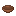

## Crucible

The crucible is a small ceramic container. In the early game it functions like an **empty cup** you can fill and empty.

## Obtaining

You can fire a clay bowl into a crucible:

- Kiln:
  - [Recipe JSON](../../../shared/src/main/resources/data/materia/recipes/clay_bowl_to_crucible.json)
- Campfire cooking (early shortcut):
  - [Recipe JSON](../../../shared/src/main/resources/data/materia/recipes/clay_bowl_to_crucible_campfire.json)

## Filling and emptying (water)

The crucible can be filled from:

- a **water source block**
- a **water cauldron** (takes 1 layer)

When filled, it becomes a **water cup**.

See: [Water cup](water-cup.md)

## Related

- [Liquids and containers (reference)](../../reference/tags/liquids-and-containers.md)
- [Water pot (mechanic)](../../mechanics/water-pot.md)
