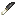

## Flint knife

An early cutting tool used for crafting and gathering.

## Crafting

- [Recipe JSON](../../../shared/src/main/resources/data/materia/recipes/flint_knife.json)

Crafting a flint knife uses:

- 1× knapped flint
- 1× bone handle
- 1× lashing (or glue)

Knapped flint wear is transferred to the knife’s durability.

## Gathering interactions

Right-click:

- spruce logs → sapped spruce log + sap
- rubber tree logs → tapped rubber tree log + latex

Higher-tier knives (like iron/steel) can also do this.
