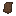

## Hardened leather

Hardened leather is a tougher leather material used by some crafting recipes (notably saddle/horse armor).

## How you get it

Hardened leather is made by **boiling** tanned leather in a water pot:

- Put a water pot above a **lit campfire** (so it boils)
- Insert `materia:tanned_leather`
- After **8 seconds** (160 ticks), it outputs `materia:hardened_leather`

Source of truth (1.18.2):

- `1.18.2/src/main/java/com/torr/materia/blockentity/WaterPotBlockEntity.java`

See also:

- [Leatherworking (tanning + hardening)](../../mechanics/leatherworking.md)
- [Water pot](../../mechanics/water-pot.md)

