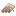
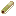

## Instruments

This page covers the craftable instrument families and their element “flavors”.

All instruments share the same core behavior:

- using the item queues it to start on a shared beat (so group play lines up)
- it plays a repeating sample while you keep using it

See: [Instruments (mechanics)](../../mechanics/instruments.md)

## Element colors (how you choose the sound set)

Many instrument recipes use dye *tags*:

- **Air**: [`#materia:yellow_dyes`](../../reference/tags/dyes.md#materiayellow_dyes)
- **Earth**: [`#materia:green_dyes`](../../reference/tags/dyes.md#materiagreen_dyes)
- **Fire**: [`#materia:red_dyes`](../../reference/tags/dyes.md#materiared_dyes)
- **Water**: [`#materia:blue_dyes`](../../reference/tags/dyes.md#materiablue_dyes)

## Flutes

Icons:

Recipe JSONs:

- `shared/src/main/resources/data/materia/recipes/air_flute.json`
- `shared/src/main/resources/data/materia/recipes/earth_flute.json`
- `shared/src/main/resources/data/materia/recipes/fire_flute.json`
- `shared/src/main/resources/data/materia/recipes/water_flute.json`

Common pattern:

- 3× [`#materia:reeds`](../../reference/tags/plants-and-farming.md#materiareeds)
- [`#materia:adhesives`](../../reference/tags/bindings-and-adhesives.md#materiaadhesives)
- [`#materia:basic_lashings`](../../reference/tags/bindings-and-adhesives.md#materiabasic_lashings)
- an element dye tag (yellow/green/red/blue)

## Drums

There is a base `materia:drum`, and you can combine two drums plus a dye tag to get an elemental “drums” item.

Icons:

Recipe JSONs:

- base drum: `shared/src/main/resources/data/materia/recipes/drum.json`
- variants:
  - `shared/src/main/resources/data/materia/recipes/air_drums.json`
  - `shared/src/main/resources/data/materia/recipes/earth_drums.json`
  - `shared/src/main/resources/data/materia/recipes/fire_drums.json`
  - `shared/src/main/resources/data/materia/recipes/water_drums.json`

## Bass

Icons:

Recipe JSONs:

- `shared/src/main/resources/data/materia/recipes/air_bass.json`
- `shared/src/main/resources/data/materia/recipes/earth_bass.json`
- `shared/src/main/resources/data/materia/recipes/fire_bass.json`
- `shared/src/main/resources/data/materia/recipes/water_bass.json`

Common pattern:

- [`#materia:reeds`](../../reference/tags/plants-and-farming.md#materiareeds)
- [`#materia:basic_lashings`](../../reference/tags/bindings-and-adhesives.md#materiabasic_lashings)
- an element dye tag (yellow/green/red/blue)
- [`#materia:all_glues`](../../reference/tags/bindings-and-adhesives.md#materiaall_glues)
- `minecraft:redstone`
- [`#materia:all_cutting_tools`](../../reference/tags/early-crafting-and-woodworking.md#materiaall_cutting_tools)

## Harp

Icons:

Recipe JSONs:

- `shared/src/main/resources/data/materia/recipes/air_harp.json`
- `shared/src/main/resources/data/materia/recipes/earth_harp.json`
- `shared/src/main/resources/data/materia/recipes/fire_harp.json`
- `shared/src/main/resources/data/materia/recipes/water_harp.json`

Harp crafting is similar to bass, but also requires:

- [`#materia:strings`](../../reference/tags/textiles-and-storage.md#materiastrings)

## Maracas (extra family)

Maracas are also implemented as instruments and follow the same synced playback rules.

Recipes:

- `shared/src/main/resources/data/materia/recipes/air_maraca.json`
- `shared/src/main/resources/data/materia/recipes/earth_maraca.json`
- `shared/src/main/resources/data/materia/recipes/fire_maraca.json`
- `shared/src/main/resources/data/materia/recipes/water_maraca.json`
- `shared/src/main/resources/data/materia/recipes/life_maraca.json`

Note: the “life” maraca uses [`#materia:purple_dyes`](../../reference/tags/dyes.md#materiapurple_dyes).

