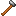

## Wrought iron hammer

The **wrought iron hammer** (`materia:iron_hammer`) is the first hammer that satisfies `#materia:iron_hammers`, which is required by some bronze-anvil “iron age” milestone crafts (like the wrought iron anvil itself).

Do not confuse with the top-tier [refined iron hammer](refined-iron-hammer.md) (`materia:steel_hammer`, displayed as **Iron Hammer**).

## Crafting

- `shared/src/main/resources/data/materia/recipes/iron_hammer.json`

Ingredients:

- `materia:iron_hammer_head`
- `materia:bronze_handle`
- `#materia:advanced_bindings`

## Getting the wrought iron hammer head (bronze anvil)

- `shared/src/main/resources/data/materia/recipes/bronze_anvil/iron_hammer_head_from_ingot.json`
  - `materia:wrought_iron_ingot` → `materia:iron_hammer_head`
  - Requires `#materia:bronze_hammers`

## Getting a bronze handle (bronze anvil)

- `shared/src/main/resources/data/materia/recipes/bronze_anvil/bronze_handle_from_rod.json`

## Related

- [Wrought iron ingot](wrought-iron-ingot.md)
- [Refined iron hammer](refined-iron-hammer.md)
- Tag reference: [Bindings and adhesives](../../reference/tags/bindings-and-adhesives.md)
