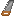

## Iron saw

The iron saw is a wrought-iron woodworking tool. It behaves like the [bronze saw](bronze-saw.md) but lasts longer (**400** durability vs **300**).

Use it anywhere a saw is required — including **rough → smooth plank** recipes and `#materia:all_saws` tag checks.

## Crafting

- `shared/src/main/resources/data/materia/recipes/iron_saw.json`

Ingredients:

- `materia:iron_saw_band`
- `materia:handle`
- `#materia:adhesives`

Tag reference:

- `#materia:adhesives`: [Bindings and adhesives](../../reference/tags/bindings-and-adhesives.md#materiaadhesives)

## Getting an iron saw band

The saw band is an **iron anvil** product:

- `shared/src/main/resources/data/materia/recipes/iron_anvil/iron_saw_band_from_plate.json`
  - Input: `materia:iron_plate`
  - Tools: `#materia:iron_hammers` + `#materia:iron_chisels`

The iron plate is also an iron-anvil product (from a wrought iron ingot).

## Related

- [Bronze saw](bronze-saw.md) (earlier tier)
- [Iron hammer](iron-hammer.md)
- [Anvils](../../mechanics/anvils.md)
- [Metalworking](../../mechanics/metalworking.md)
