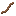

## Leather strap

Leather straps are a basic “binding” component used in a lot of recipes (armor components, saddle/horse armor, etc.).

## Crafting

- `shared/src/main/resources/data/materia/recipes/leather_strap.json`

This recipe cuts straps from tanned leather:

- `materia:tanned_leather` + `#materia:all_cutting_tools` → 4× `materia:leather_strap`

Related:

- [Tanned leather](tanned-leather.md)
- [Leatherworking (mechanic)](../../mechanics/leatherworking.md)
- Tag reference: [Bindings and adhesives](../../reference/tags/bindings-and-adhesives.md)

