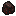

## Redstone fuel

Redstone fuel is a crafted fuel item that burns longer than coal/charcoal.

## Crafting

- `shared/src/main/resources/data/materia/recipes/redstone_fuel.json`

Recipe:

- 2× [`#materia:basic_fuels`](../../reference/tags/fuels.md#materiabasic_fuels) + 1× `minecraft:redstone` → 2× `materia:redstone_fuel`

## Fuel value

In 1.18.2:

- Burn time: **2400 ticks** (about 1.5× coal/charcoal)

Source of truth (1.18.2):

- `1.18.2/src/main/java/com/torr/materia/utils/FuelHelper.java`

## Related

- [Heat and fuel overview](../../mechanics/heat.md)

