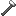

## Refined iron hammer

The **iron hammer** (`materia:steel_hammer`, registry id unchanged) is the top-tier hammer in Materia’s metalworking chain. It is **not** the same as the [wrought iron hammer](iron-hammer.md) (`materia:iron_hammer`).

Higher-tier hammer tags generally satisfy lower-tier anvil recipes.

## Crafting

- `shared/src/main/resources/data/materia/recipes/steel_hammer.json`

Ingredients:

- `materia:steel_hammer_head`
- `materia:iron_handle` (wrought iron handle)
- `#materia:advanced_bindings`

## Making an iron hammer head (wrought iron anvil)

- `shared/src/main/resources/data/materia/recipes/iron_anvil/steel_hammer_head_from_ingot.json`
  - Input: `minecraft:iron_ingot`
  - Tools: `#materia:iron_hammers` (3 tool slots)

## Related

- [Iron ingot (refined iron)](iron-ingot.md)
- [Wrought iron hammer](iron-hammer.md)
- [Anvils](../../mechanics/anvils.md)
- [Metalworking (overview)](../../mechanics/metalworking.md)
