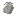
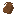
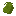
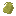
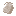

## Sacks

Sacks are **portable storage items**. Right-click a sack while holding it to open its inventory.

## Storage

- **Size**: 4 slots (2×2)
- **Nested storage**: you can’t put sacks inside other sacks, BUT you can put them in baskets and chests
- **Tooltip**: shows a total “Contains: X items” count when non-empty

## Obtaining

Sacks are crafted from **carpet + needle + string**.

Examples:

- White carpet → white sack:
  - [Recipe JSON](../../../shared/src/main/resources/data/materia/recipes/white_sack.json)
- Tyrian purple carpet → tyrian purple sack:
  - [Recipe JSON](../../../shared/src/main/resources/data/materia/recipes/tyrian_purple_sack.json)

## Related

- **Strings**: `#materia:strings` (see [Textiles and storage materials](../../reference/tags/textiles-and-storage.md#materiastrings))
- **Needles**: `#materia:all_needles` (see [Textiles and storage materials](../../reference/tags/textiles-and-storage.md#materiaall_needles))
