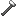

## Steel hammer

The steel hammer is the top-tier hammer in Materia’s metalworking tool chain (1.18.2). Higher-tier hammer tags generally satisfy lower-tier recipes.

## Crafting

- `shared/src/main/resources/data/materia/recipes/steel_hammer.json`

Ingredients:

- `materia:steel_hammer_head`
- `materia:iron_handle`
- `#materia:advanced_bindings`

## Making a steel hammer head (iron anvil)

- `shared/src/main/resources/data/materia/recipes/iron_anvil/steel_hammer_head_from_ingot.json`
  - Input: `minecraft:iron_ingot` (Steel ingot)
  - Tools: `#materia:iron_hammers` (3 tool slots)

## Related

- [Steel ingot](steel-ingot.md)
- [Anvils](../../mechanics/anvils.md)
- [Metalworking (overview)](../../mechanics/metalworking.md)

