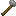

## Stone hammer

An early tool used for crafting and processing.

## Crafting

- [Recipe JSON](../../../shared/src/main/resources/data/materia/recipes/stone_hammer.json)

## Notes

- Used by early recipes like knapping flint
- Used by primitive crafting (the primitive crafting table recipe requires the hammer to be at least 50% durability)
