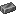

## Wrought iron ingot

Wrought iron is Materia’s early **iron-age** metal (`materia:wrought_iron_*` and most `materia:iron_*` tools/components). Display names use **Wrought Iron** explicitly so they are not confused with refined iron (`minecraft:iron_ingot` / `materia:steel_*` parts, displayed as **Iron**).

## Getting wrought iron ingots

### Kiln

- `shared/src/main/resources/data/materia/recipes/wrought_iron_ingot.json`
  - `minecraft:raw_iron` → `materia:wrought_iron_ingot`

### Bronze anvil (from nuggets)

If you have nuggets:

- `shared/src/main/resources/data/materia/recipes/bronze_anvil/wrought_iron_ingot_from_nuggets.json`
  - 9× `materia:wrought_iron_nugget` + `#materia:bronze_hammers` → `materia:wrought_iron_ingot`

## Used for

- Making wrought iron blocks (for the iron anvil):
  - `shared/src/main/resources/data/materia/recipes/bronze_anvil/iron_block_from_ingots.json`
- Making iron hammer heads (bronze anvil):
  - `shared/src/main/resources/data/materia/recipes/bronze_anvil/iron_hammer_head_from_ingot.json`

Related:

- [Iron anvil (blocks)](../blocks/anvils.md)
- [Wrought iron armor (`materia:iron_*`)](wrought-iron-armor.md)

