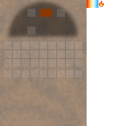
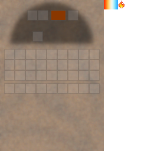
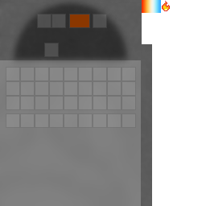

## Kilns

Kilns are the main “industrial heat” machines in Materia.

## GUIs (by variant)

## Kiln variants

- **Kiln**: basic kiln behavior
- **Kiln + chimney**: enables advanced kiln menu/recipes
- **Kiln + chimney + bellows**: higher temperature tier for the hottest recipes
- **Furnace kiln**: a kiln variant that uses a dedicated furnace-style menu
- **Blast furnace kiln**: faster cooking time and behaves as if chimney is always present

## Fuel

Kilns accept a broad set of fuel items (wood fuels, coal/charcoal, pitch/tar, etc.).
Coal coke is supported and burns longer.

See also: [Heat and fuel overview](heat.md)

## Steelmaking (Steel Age)

In 1.18.2 implementation, the “steel” recipe (which produces `minecraft:iron_ingot`, displayed as “Steel ingot”) is gated:

- Requires **coal coke fuel**
- Requires either:
  - a **blast furnace kiln**, or
  - a **furnace kiln** with a **furnace chimney** above it

See:

- [Steel ingot](../content/items/steel-ingot.md)
- [Coke oven](../content/blocks/coke-oven.md)

## First metals (Neolithic → Bronze ramp)

The earliest “metal” loop usually looks like:

- find ore sources (tin gravel, malachite)
- convert ores into **nuggets** in a kiln
- consolidate nuggets on a **stone anvil** into ingots
- upgrade your kiln with a **chimney** so you can run **two-input / advanced kiln** recipes (alloys like bronze)

Key early recipes in `shared/`:

- Tin nuggets:
  - `shared/src/main/resources/data/materia/recipes/raw_tin_to_tin_ingot.json`
- Copper nuggets:
  - `shared/src/main/resources/data/materia/recipes/raw_copper_to_copper_ingot.json`
- Nugget → ingot (stone anvil):
  - `shared/src/main/resources/data/materia/recipes/stone_anvil/tin_ingot_from_nuggets.json`
  - `shared/src/main/resources/data/materia/recipes/stone_anvil/copper_ingot_from_nuggets.json`
- Bronze alloy (advanced kiln, requires chimney):
  - `shared/src/main/resources/data/materia/recipes/bronze_alloy.json`
  - `shared/src/main/resources/data/materia/recipes/bronze_alloy_with_ingot.json`

Related blocks/items:

- [Tin gravel](../content/blocks/gravel-tin.md)
- [Malachite](../content/blocks/malachite.md)
- [Wood tongs](../content/items/tongs.md) (strongly recommended for hot outputs)

## Hot output (important)

When the kiln is burning, it periodically “refreshes” heat on the output slot, keeping **heatable metals** hot.

That means:

- You generally need **tongs** to safely pull metal outputs.

## Tongs interactions

When holding tongs:

- **Right-click** the kiln to extract hot metal from the output slot
- **Shift + right-click** extracts as many as will fit in the tongs

Related:

- [Hot metals](hot-metals.md)
- [Tongs](../content/items/tongs.md)
